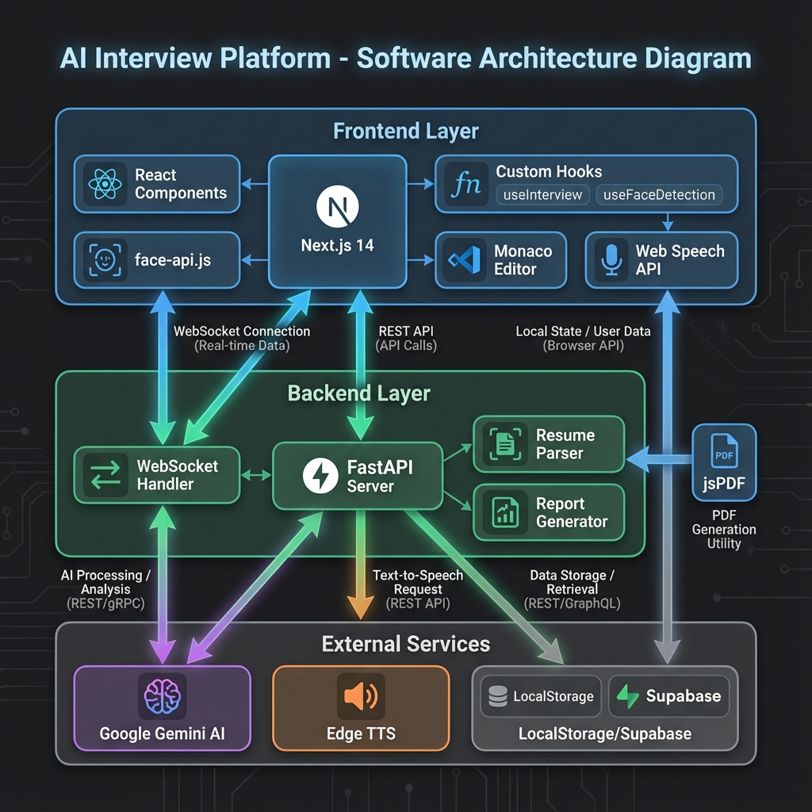
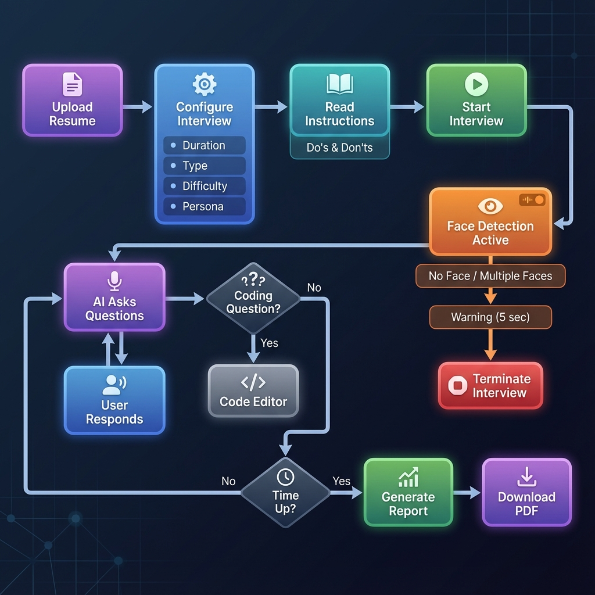

# 🎯 AI Dronacharya - AI Interview Platform

An AI-powered video interview platform that conducts realistic mock interviews with **Shreya**, your AI interviewer. Get detailed performance feedback, skill gap analysis, and comprehensive report cards.

   

## 🏗️ Architecture



## 🔄 Process Flow



## ✨ Features

### 🎙️ Interview Experience
- **Voice-based AI Interviewer** - Natural conversation with Shreya using Neural voice
- **Real-time Speech Recognition** - Speak naturally and get instant transcription
- **Video Proctoring** - Full-screen mode with violation detection
- **Configurable Duration** - 5 to 60 minute interviews
- **Pre-Interview Instructions** - Do's & Don'ts guide before starting

### 🔐 Advanced Proctoring & Face Detection
- **Face Detection** - Real-time monitoring using face-api.js
- **Zero-Face Detection** - Interview terminates if user leaves camera view (5s threshold)
- **Multiple Person Detection** - Interview terminates if additional people are detected (5s threshold)
- **Tab Switch Detection** - Warns user when focus is lost
- **Copy/Paste Prevention** - Disabled in code editor (like real interviews)

### 💻 Code Editor (For Technical Interviews 10+ min)
- **Monaco Editor** - Full-featured code editor with syntax highlighting
- **9 Languages Supported** - JavaScript, TypeScript, Python, Java, C++, C#, Go, Rust, SQL
- **Code Submission** - Submit and get AI evaluation of your solutions
- **Resubmit Support** - Edit and resubmit code multiple times

### 🎭 Customization Options
- **Interviewer Personas** - Friendly 😊, Balanced 🎯, or Strict 👔
- **Difficulty Levels** - Junior, Mid-Level, Senior, Lead/Staff
- **Interview Types** - Technical 💻, Behavioral 🗣️, or Mixed 🎯
- **Practice Mode** - Unlimited retries without saving results

### 📊 Real-time Analytics
- **Confidence Score** - Analyzed from filler words, response time, and detail level
- **Filler Word Counter** - Tracks "um", "uh", "like", "you know", etc.
- **Response Time Tracking** - Measures time between AI questions and your responses
- **Live Metrics Display** - Color-coded indicators during interview
- **Face Count Indicator** - Shows detected persons in camera view

### 📋 Reports & Analysis
- **PDF Report Cards** - Professional styled reports with branding
- **Skill Gap Analysis** - Resume vs interview performance comparison
- **Dynamic Scoring** - 1-10 scale based on actual performance
- **Interview History** - Save and review past interviews in dashboard
- **Code Evaluation** - AI assessment of submitted code solutions
- **Comprehensive Statistics** - Confidence score, word count, response time, filler words

## 🚀 Quick Start

### Prerequisites
- Python 3.8+
- Node.js 18+
- Gemini API Key (free from Google AI Studio)

### Setup

1. **Clone the repository**
```bash
git clone https://github.com/YOUR_USERNAME/ai-dronacharya.git
cd ai-dronacharya
```

2. **Create environment file**
```bash
cp .env.example .env
```

3. **Add your API keys to `.env`**
```env
GEMINI_API_KEY=your_gemini_api_key
```

4. **Run the application**
```bash
./start.bat
```

5. **Open in browser**
- Frontend: http://localhost:3000
- Backend: http://localhost:8000

## 🛠️ Tech Stack

| Layer | Technology |
|-------|------------|
| Frontend | Next.js 14, React, TypeScript, Tailwind CSS |
| Backend | Python, FastAPI, WebSocket |
| AI | Google Gemini 1.5 Flash |
| TTS | Edge TTS (Neerja Neural voice - Indian English) |
| Face Detection | face-api.js with TinyFaceDetector |
| Code Editor | Monaco Editor |
| PDF Generation | jsPDF |
| Storage | LocalStorage / Supabase |

## 📁 Project Structure

```
├── frontend/                   # Next.js application
│   ├── app/                   # Pages and layouts
│   │   ├── page.tsx          # Landing page
│   │   ├── interview/        # Interview room
│   │   └── dashboard/        # Interview history
│   ├── components/            # React components
│   │   ├── InterviewRoom.tsx # Main interview UI
│   │   └── CodeEditor.tsx    # Monaco code editor
│   ├── hooks/                 # Custom React hooks
│   │   ├── useInterview.ts   # WebSocket handling
│   │   ├── useFaceDetection.ts # Face detection logic
│   │   ├── useProctoring.ts  # Tab switch detection
│   │   └── useSpeechRecognition.ts
│   ├── lib/                   # Utilities
│   │   └── interviewStorage.ts # PDF generation & storage
│   └── public/models/         # Face detection models
├── backend/                   # FastAPI server
│   ├── main.py               # API endpoints & AI prompts
│   └── services/
│       └── tts.py            # Text-to-speech service
└── start.bat                 # One-click launcher
```

## � Interview Flow

1. **Upload Resume** - Upload your PDF resume for AI analysis
2. **Configure Interview** - Select duration, type, difficulty, and persona
3. **Read Instructions** - Review Do's & Don'ts before starting
4. **Start Interview** - Camera, microphone, and full-screen mode activated
5. **Answer Questions** - Speak naturally; AI transcribes and responds
6. **Code Questions** - For 10+ min technical interviews, solve coding problems
7. **Get Report** - Receive detailed performance report and download PDF

## ⚠️ Interview Termination Rules

The interview will be automatically terminated if:
- **No face detected** for more than 5 seconds
- **Multiple persons detected** in camera for more than 5 seconds
- **Excessive tab switches** or focus loss violations

## �🔒 Security

- Resume analysis happens server-side
- API keys stored in `.env` (not committed to git)
- Proctoring detects tab switches and focus loss
- Face detection ensures only one person is present
- Copy/paste disabled in code editor

## 🎨 UI Features

- **Glassmorphism Design** - Modern, semi-transparent UI elements
- **Gradient Animations** - Smooth color transitions
- **Real-time Indicators** - Face count, listening status, AI speaking status
- **Warning Overlays** - Visual alerts for proctoring violations
- **Responsive Layout** - Works on various screen sizes

## 📝 License

MIT License - feel free to use for your own projects!

## 🙏 Acknowledgments

- Google Gemini for AI capabilities
- Microsoft Edge TTS for voice synthesis
- Monaco Editor for code editing
- face-api.js for face detection
- The open-source community

---

**Made with ❤️ for the AI Interview Hackathon**
